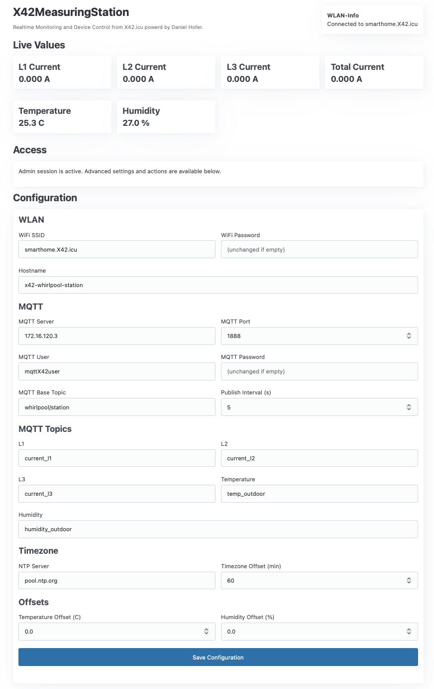
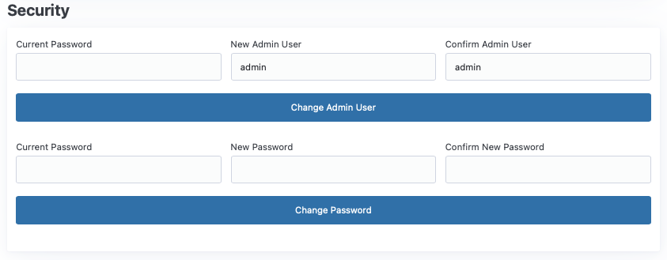
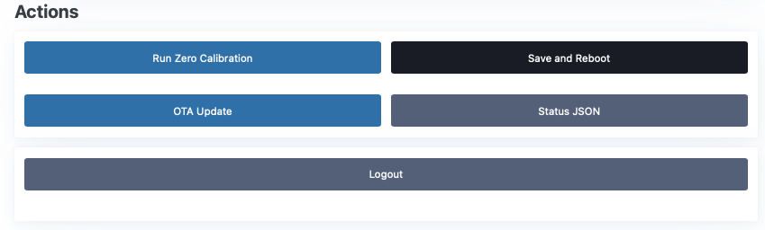

# X42-IoT-MeasuringStation-Whirlpool

A long-term, maintainable project workspace for an IoT measuring station focused on Whirlpool-related monitoring and expansion.

Current runtime baseline: PlatformIO + ESP32 Arduino framework targeting ESP-WROOM-32 modules.

## Purpose

This repository implements a Whirlpool-focused IoT measuring station.

At project completion, the station is intended to provide:

- Three-phase electrical consumption monitoring (`L1`, `L2`, `L3`).
- Water temperature monitoring.
- Water pH monitoring.
- Outdoor air temperature and humidity monitoring near the maintenance shaft.
- Daylight brightness monitoring.
- A local display showing date, time, pH value, and water temperature.

The system is designed to be integrated into the local network over Wi-Fi and publish measurements through MQTT.
Additional device functions should be triggerable over MQTT, including calibration workflows for pH, current, and other sensors.

Planned platform-level capabilities include:

- OTA firmware updates.
- An onboard web server with a dashboard for all measurement values.
- Password-protected calibration actions after login on the web interface.
- An HTTP status endpoint exposing key measurements as JSON.

## Project Structure

- `src/`: Application source code
- `docs/`: Project documentation and decision history
- `scripts/`: Automation and developer scripts
- `config/`: Configuration templates and environment-specific settings
- `tests/`: Test suites and test helpers
- `.github/`: Collaboration templates for issues and pull requests

## Getting Started

1. Read `docs/setup-guide.md`
2. Review architecture and constraints in `docs/architecture.md`
3. Check `docs/decision-log.md` for key decisions
4. Use `TODO.md` for current priorities
5. For current sensing hardware, review `docs/sensors-sct013.md`
6. For maintenance shaft temperature/humidity monitoring, review `docs/sensors-dht11.md`

## PlatformIO Quick Start

1. Connect the ESP-WROOM-32 board via USB.
2. Open the PlatformIO panel in VS Code.
3. Build the firmware using the configured environment.
4. Upload to the device.
5. Open Serial Monitor at 115200 baud.

The default firmware prints startup telemetry and chip information.
For three-phase current sensing, the firmware labels channels as `L1`, `L2`, and `L3` on GPIO34, GPIO35, and GPIO32.
The firmware also reads a DHT11 sensor on GPIO4 for maintenance shaft temperature and humidity.

For mass deployment with per-batch defaults, copy `src/device_config.example.h` to `src/device_config.h`
and edit values there (admin user/password, Wi-Fi, MQTT, hostname, NTP/timezone, sensor names, publish interval).
`src/device_config.h` is intentionally gitignored and overrides the example defaults at build time.

## Current ESP32 Capabilities

- Three-phase current monitoring (`L1`, `L2`, `L3`) with SCT013 sensors.
- Persisted zero-current calibration with manual refresh command (`z`) via serial monitor.
- Temperature and humidity monitoring in the maintenance shaft using a DHT11 sensor.
- Runtime serial telemetry for electrical and climate data.
- Embedded web server with password-protected configuration for Wi-Fi, MQTT, hostname, MQTT sensor names, and publish interval.
- Time synchronization via configurable NTP server and timezone offset.
- Optional MQTT time synchronization command support (`cmd/time` or `cmd` with `time=<epoch>`).
- Admin user and password change via web interface.
- HTTP status endpoint (`/status.json`) exposing measurements in JSON.
- OTA firmware update via browser upload and Arduino OTA support.
- MQTT telemetry publishing for all currently integrated sensors.

## Web Configuration Example

Example screenshot of the current web-based configuration page:

## Web Security Example

Example screenshot of the Security section in the web interface.
In this area, both the admin username and the admin password can be changed.

## Web Actions and Logout Example

Example screenshot of the Actions and Logout area in the web interface.
This section provides operational actions such as zero calibration, reboot, OTA update, status access, and logout.

## Collaboration

- Branch strategy: `main` + short-lived feature branches (`feature/<topic>`)
- Commit messages: clear, imperative, and scoped (e.g. `docs: add initial architecture baseline`)
- Pull requests should include rationale, testing notes, and documentation updates when relevant.

## Status

Initial workspace baseline prepared and ready for implementation.
